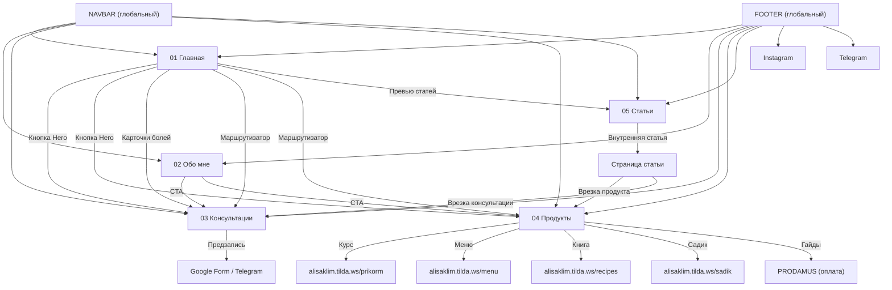

# 🔻 Глобальные компоненты: NAVBAR + FOOTER

> **Файл:** `06_global.md`
> **Компоненты:** Навигационная панель (Navbar) и Подвал (Footer).
> **Расположение:** Присутствуют на КАЖДОЙ странице сайта.

---

## NAVBAR (Навигационная панель)

**Тип блока:** Фиксированная шапка сайта (sticky top)
**Фон:** Кремовый (#FDFBF7) с лёгкой полупрозрачностью (backdrop-blur)
**Высота:** ~80px
**Маркетинговая логика:** Навигация должна быть простой и не перегруженной. Максимум 5–6 пунктов. Кнопка CTA всегда видна.

### Элементы:

| # | Элемент | Тип | Текст / Содержимое | Стиль | Ссылка ведёт на |
|---|---------|-----|---------------------|-------|-----------------|
| N.1 | Логотип / Имя | Текст | `АЛИСА КЛИМОВА` | Serif, 20px, font-semibold, tracking-wide, оливковый | → `01_main.md` (верх) |
| N.2 | Пункт меню 1 | Ссылка | `Главная` | Sans, 14px, font-medium, hover: text-terracotta | → `01_main.md` |
| N.3 | Пункт меню 2 | Ссылка | `Обо мне` | То же | → `02_about.md` |
| N.4 | Пункт меню 3 | Ссылка | `Консультации` | То же | → `03_consultations.md` |
| N.5 | Пункт меню 4 | Ссылка | `Продукты` | То же | → `04_products.md` |
| N.6 | Пункт меню 5 | Ссылка | `Статьи` | То же | → `05_articles.md` |
| N.7 | Кнопка CTA | Кнопка | `Записаться` | bg-terracotta, text-white, px-6, py-2, rounded-full, text-sm, shadow-sm | → `03_consultations.md` → Блок 5 (#signup) |

### Мобильная версия:

| # | Элемент | Тип | Текст / Содержимое | Стиль |
|---|---------|-----|---------------------|-------|
| N.M1 | Логотип | Текст | `АЛИСА КЛИМОВА` | Serif, 18px, оливковый |
| N.M2 | Бургер-меню | Иконка (☰) | Открывает боковое или полноэкранное меню | 24px, оливковый |
| N.M3 | Меню (открытое) | Список | Все пункты N.2–N.6 вертикально + кнопка N.7 внизу | Full-screen overlay, bg-cream, text-center |

### Заметки для верстки:
- В Tilda: использовать блок ME801 или ME601 (с кастомизацией через Zero Block)
- Кнопка «Записаться» скрывается на мобильном в навбаре, но появляется в раскрытом бургер-меню
- При скролле: navbar может получать лёгкую тень (shadow-sm) для визуального отделения от контента

---

## FOOTER (Подвал)

**Тип блока:** Полноширинный блок
**Фон:** Оливковый (#485446)
**Текст:** Кремовый (#FDFBF7)
**Маркетинговая логика:** Содержит навигацию (дубль), соцсети, юридическую информацию и ОБЯЗАТЕЛЬНЫЙ медицинский дисклеймер. Подвал — последний шанс дать человеку полезную ссылку перед уходом.

### Элементы — Колонка 1: Навигация

| # | Элемент | Тип | Текст / Содержимое | Стиль | Ссылка ведёт на |
|---|---------|-----|---------------------|-------|-----------------|
| F.1a | Заголовок колонки | H4 | `Навигация` | Sans, 14px, font-semibold, uppercase, tracking-widest, кремовый | — |
| F.1b | Ссылка | a | `Главная` | Sans, 14px, opacity-80, hover: opacity-100, hover: text-terracotta | → `01_main.md` |
| F.1c | Ссылка | a | `Обо мне` | То же | → `02_about.md` |
| F.1d | Ссылка | a | `Консультации` | То же | → `03_consultations.md` |
| F.1e | Ссылка | a | `Продукты` | То же | → `04_products.md` |
| F.1f | Ссылка | a | `Статьи` | То же | → `05_articles.md` |

### Элементы — Колонка 2: Соцсети

| # | Элемент | Тип | Текст / Содержимое | Стиль | Ссылка ведёт на |
|---|---------|-----|---------------------|-------|-----------------|
| F.2a | Заголовок колонки | H4 | `Соцсети` | Sans, 14px, font-semibold, uppercase, tracking-widest | — |
| F.2b | Ссылка | a | `Instagram @alisa__klim` | Sans, 14px, opacity-80 | → `https://instagram.com/alisa__klim` (target="_blank") |
| F.2c | Ссылка | a | `Telegram @klim_alisa` | То же | → `https://t.me/klim_alisa` (target="_blank") |
| F.2d | Ссылка | a | `YouTube` | То же | → Ссылка на YouTube канал (уточнить у Алисы) |

### Элементы — Колонка 3: Юридическое

| # | Элемент | Тип | Текст / Содержимое | Стиль | Ссылка ведёт на |
|---|---------|-----|---------------------|-------|-----------------|
| F.3a | Заголовок колонки | H4 | `Документы` | Sans, 14px, font-semibold, uppercase, tracking-widest | — |
| F.3b | Ссылка | a | `Договор оферты` | Sans, 14px, opacity-80 | → Отдельная страница оферты (создать) |
| F.3c | Ссылка | a | `Политика конфиденциальности` | То же | → Отдельная страница политики (создать) |

### Элементы — Дисклеймер (под колонками)

| # | Элемент | Тип | Текст / Содержимое | Стиль |
|---|---------|-----|---------------------|-------|
| F.4 | Разделитель | hr | — | border-white/10, my-8 |
| F.5 | Текст дисклеймера | p | `Консультации, рекомендации и материалы не являются медицинской помощью, диагностикой или лечением заболеваний и не заменяют консультацию врача.` | Sans, 13px, opacity-60, text-center, max-w-3xl, mx-auto |

### Связи: Все ссылки указаны в таблицах выше.

### Заметки для верстки:
- В Tilda: использовать блок FT301 или Zero Block
- На мобильном: колонки складываются в 1 столбец
- Дисклеймер ОБЯЗАТЕЛЕН на каждой странице (требование SITE_RULES.md)

---

## ВИЗУАЛЬНАЯ СХЕМА FOOTER:

```
┌──────────────────────────────────────────────────────────────┐
│                    АЛИСА КЛИМОВА                             │
│                                                              │
│  Навигация          Соцсети              Документы           │
│  ─────────          ──────               ─────────           │
│  Главная            Instagram            Договор оферты      │
│  Обо мне            Telegram             Политика конф.      │
│  Консультации       YouTube                                  │
│  Продукты                                                    │
│  Статьи                                                      │
│                                                              │
│  ──────────────────────────────────────────────────────────── │
│  Дисклеймер: Консультации, рекомендации и материалы          │
│  не являются медицинской помощью...                          │
└──────────────────────────────────────────────────────────────┘
```

---

## КАРТА СВЯЗЕЙ ВСЕГО САЙТА


